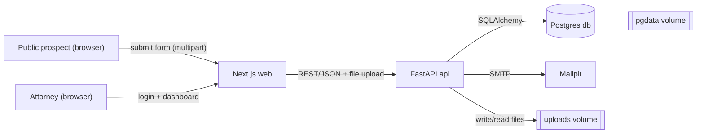
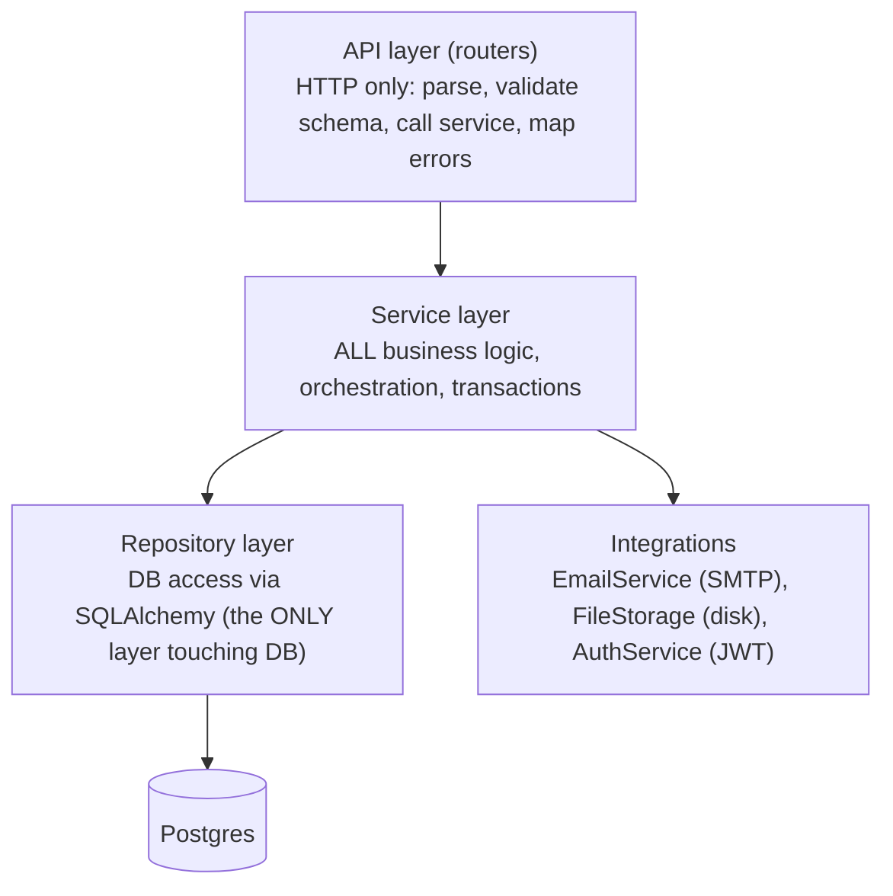

# Legal Clinic Leads — System Design Document

Date: 2026-07-01
Status: Approved (design phase)

## 1. Overview

A lead-intake application for a legal clinic. Prospects submit their details and a
resume/CV through a public form. On submission, the system persists the lead,
stores the resume file, and notifies both the prospect and an internal attorney by
email. Attorneys sign in to a guarded internal UI to view all leads and manually
advance each lead's state from `PENDING` to `REACHED_OUT` once they have reached
out.

The project is a single, standalone, self-contained application that must run and be
testable with simple commands. It is built to production standards (clean layering,
clear separation of concerns) while deliberately avoiding unnecessary complexity.

## 2. Functional Requirements

1. Create, retrieve, and update leads.
   - Leads are created via a public form. Required fields: first name, last name,
     email, resume/CV (file upload).
2. On submission, send emails to both the prospect and the internal attorney.
3. Provide an internal, auth-guarded UI that lists all leads with the information
   submitted by the prospect.
4. Each lead has a state that starts at `PENDING` and transitions to `REACHED_OUT`
   when manually marked by an attorney.

## 3. Technical Requirements & Hard Constraints

These are non-negotiable design constraints for the implementation:

- APIs implemented with **FastAPI**; web app implemented with **Next.js**.
- Persistent storage so data survives restarts, plus an integrated email service.
- Production-style repository structure with clearly separated architecture layers.
- **The API layer must be thin.** No business logic may live in router/endpoint
  files. Routers only parse input, validate against schemas, call a service, and map
  results/errors to HTTP responses.
- **Only the service layer orchestrates business logic**, and **only the repository
  layer touches the database.** API endpoints talk to services; services talk to
  repositories; repositories talk to the DB. No layer-skipping.
- Clean layering must allow future components (roles, refresh tokens, S3, additional
  providers) to be plugged in without overhauling the codebase.

## 4. Technology Decisions & Rationale

| Concern | Decision | Rationale |
| --- | --- | --- |
| Database | **PostgreSQL** via SQLAlchemy + Alembic | Production-credible; native `ENUM` for lead state; clean `ALTER`-based migrations; real concurrent-write support. SQLAlchemy keeps app code DB-agnostic, so the cost over SQLite is ~zero once Docker Compose is adopted. |
| Email | **Mailpit** (single container, SMTP + web inbox) | Real-time visibility of both emails in a browser inbox during testing; no external API keys. Accessed only through a thin `EmailService` interface, called only from the service layer. |
| Auth | **FastAPI-issued JWT**, single seeded attorney user | Self-contained, no third party, demonstrable. Login logic lives in a dedicated `AuthService`, never in the router. |
| File storage | **Local disk** on a mounted volume; DB stores only metadata | Simple for a standalone app; a thin `FileStorage` interface (called only from the service) makes S3 a future drop-in. |
| Runtime | **Docker Compose** (4 services) | One-command run; production-like; explicit dependency ordering and health gating. |

### 4.1 Database: Postgres vs SQLite (tradeoffs considered)

Because the app uses SQLAlchemy + Alembic, the application code is nearly identical
between the two; the database is chosen by a connection string. The decision came
down to runtime characteristics and production credibility:

- **Concurrency:** Postgres is a client/server DB built for concurrent writes;
  SQLite serializes writes with a file-level lock and can raise `database is locked`
  under concurrent load.
- **State enum:** Postgres enforces the `PENDING`/`REACHED_OUT` enum at the DB level;
  SQLite stores it as text with, at best, a check constraint.
- **Migrations:** Alembic works with both, but SQLite cannot do most `ALTER TABLE`
  operations and requires "batch mode" rebuild workarounds; Postgres handles `ALTER`
  natively.
- **Simplicity:** SQLite needs no server, but since Docker Compose is already
  adopted, Postgres is just one more auto-started service, neutralizing that
  advantage.
- **Testing:** Tests run against Postgres (a throwaway test database) to avoid
  dialect drift ("passes on SQLite, breaks on Postgres").

## 5. Architecture

### 5.1 Deployment topology (4 Compose services)



### 5.2 Backend layering (strict)



Rules enforced by this layering:

- Routers depend on services only.
- Services depend on repositories and integration interfaces (injected).
- Only repositories import/query SQLAlchemy models.
- Integrations are accessed exclusively through interfaces so implementations
  (SMTP, disk, JWT) can be swapped without touching business logic.

### 5.3 Backend package layout (`apps/api`)

```
app/
  main.py                  # FastAPI app factory, router registration, /health
  core/                    # config (pydantic-settings), security/JWT helpers, logging
  api/
    deps.py                # DI: get_db session, get_current_attorney
    routers/
      leads.py             # thin: POST /leads (public), GET /leads, PATCH /leads/{id}/state
      auth.py              # thin: POST /auth/login
  schemas/                 # Pydantic request/response DTOs (LeadCreate, LeadOut, ...)
  services/
    lead_service.py        # create/list/update-state + email orchestration
    auth_service.py        # login, password verify, token issue (NOT in router)
  repositories/
    lead_repository.py     # SQLAlchemy queries for Lead
    user_repository.py     # SQLAlchemy queries for attorney user
  integrations/
    email/                 # EmailService interface + SMTP (Mailpit) impl + templates
    storage/               # FileStorage interface + local-disk impl
  db/
    models.py              # SQLAlchemy ORM models (Lead, User)
    session.py             # engine + SessionLocal
    seed.py                # idempotent attorney seed
  alembic/                 # migrations
tests/                     # unit (services w/ mocks) + integration (API + test Postgres)
```

## 6. Persistence, Volumes & File Storage

- **Named volumes:**
  - `pgdata` → Postgres data directory. Persists lead records across restarts.
  - `uploads` → resume files on disk, mounted into `api` (e.g. `/app/uploads`).
    Persists CVs across restarts.
  - Mailpit inbox is intentionally ephemeral so `docker compose down -v` yields a
    clean demo inbox.
- **Resume handling:** the file is written to disk under a unique, collision-proof
  name (so two `resume.pdf` uploads never overwrite each other). The database stores
  only metadata: stored path/key, original filename, content type, and size — never
  the file bytes.
- **Validation:** light checks on file type and size at the service boundary.
- **Swap path:** the `FileStorage` interface (called only from the service) allows a
  future S3 implementation without changing business logic. S3 is not built now.

## 7. Orchestration, Startup Ordering & Migrations

- **Startup ordering / health gating:**
  - `db` has a healthcheck (`pg_isready`).
  - `mailpit` starts in parallel with `db` (no dependency).
  - `api` uses `depends_on: db: condition: service_healthy` to avoid the
    connection-refused race.
  - `web` uses `depends_on: api: condition: service_healthy`; `api` exposes a
    `/health` endpoint used for its healthcheck.
- **Migrations run at container startup, not image build** (the DB is unreachable
  during `docker build`). The `api` entrypoint runs: `alembic upgrade head` → seed →
  `uvicorn`.
- **Migration ordering & idempotency:** Alembic tracks applied revisions in
  `alembic_version` (stored in `pgdata`) and applies only what is missing, in order.
  Wiping `pgdata` via `docker compose down -v` cleanly re-runs all migrations from
  scratch.
- **Idempotent seeding:** the single attorney user is seeded via query-by-email /
  `get_or_create` (or `INSERT ... ON CONFLICT DO NOTHING`) so repeated entrypoint
  runs never create duplicates.

## 8. Data Model (initial)

- **User (attorney)**
  - `id`, `email` (unique), `hashed_password`, `created_at`.
  - Single seeded user; no registration/roles in scope.
- **Lead**
  - `id`, `first_name`, `last_name`, `email`, `state` (`PENDING` | `REACHED_OUT`,
    Postgres enum, default `PENDING`).
  - Resume metadata: `resume_path`/key, `resume_original_name`, `resume_content_type`,
    `resume_size`.
  - `created_at`, `updated_at`.

## 9. API Surface (initial)

- `POST /leads` — public. Multipart form (fields + resume file). Creates a lead,
  stores the file, triggers prospect + attorney emails. Returns the created lead.
- `GET /leads` — auth-guarded. Lists all leads.
- `PATCH /leads/{id}/state` — auth-guarded. Transitions a lead's state
  (`PENDING` → `REACHED_OUT`).
- `POST /auth/login` — issues a JWT for the seeded attorney.
- `GET /health` — liveness/readiness for the `web` healthcheck dependency.

## 10. Auth Scope

- FastAPI-issued JWT, single seeded attorney (email + password).
- Login logic isolated in `AuthService`; routers only call it and return the token.
- Deliberately minimal: no refresh tokens, password reset, registration, or roles.
  Clean layering allows these to be added later without a rewrite.

## 11. Email Behavior

- Triggered from the service layer after a lead is successfully persisted.
- Two messages: confirmation to the prospect and notification to the attorney.
- Sent via the `EmailService` interface backed by an SMTP implementation pointed at
  Mailpit; both messages are viewable in the Mailpit web inbox during testing.

## 12. Testing Strategy

- **Unit tests:** service-layer logic with repositories and integrations mocked.
- **Integration tests:** API endpoints end-to-end against a throwaway test Postgres
  (to avoid dialect drift), asserting persistence, state transitions, auth guarding,
  file handling, and email dispatch (via a captured/inspected transport).

## 13. Out of Scope (YAGNI)

- Refresh tokens, password reset, self-registration, multi-role authorization.
- S3 / cloud object storage (interface provided for future swap only).
- Cloud deployment pipeline.
- Lead states beyond `PENDING` and `REACHED_OUT`.
