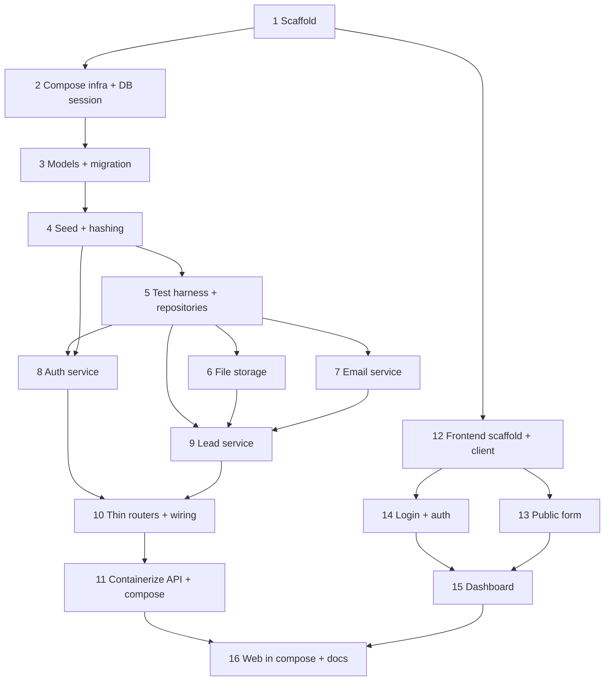

# Legal Clinic Leads — Implementation Plan

Date: 2026-07-01
Source of truth: [docs/design.md](design.md)

## How to use this plan

- Tasks are ordered by dependency. Execute top to bottom.
- Each task is sized for ONE fresh agent session and must end in a working,
  committable state.
- Each task lists: what it delivers, files/areas touched, dependencies (earlier
  tasks), and exact verification steps.
- Layering is respected in the split: infra/config → DB models/migrations → seed →
  repositories → integrations → services → thin routers → containerized API →
  frontend → full-stack compose.
- Commit boundaries: each task = one commit (or a few small commits). The author
  runs git manually; the plan never runs git.
- Scope is limited to the design doc. Nothing from the "Out of Scope" section.

Repo shape target: a monorepo with `apps/api` (FastAPI) and `apps/web` (Next.js),
`docker-compose.yml` at the root, and this `docs/` folder.

---

## Task 1 — Repo scaffold & backend skeleton

- Delivers: Monorepo layout and a minimal runnable FastAPI app with configuration
  and a health endpoint. No DB yet.
- Touches:
  - `.gitignore`, root `README.md` (run instructions stub).
  - `apps/api/requirements.txt` (fastapi, uvicorn, pydantic, pydantic-settings).
  - `apps/api/app/__init__.py`, `apps/api/app/main.py` (app factory + router
    registration + `GET /health` returning `{"status":"ok"}`).
  - `apps/api/app/core/config.py` (pydantic-settings `Settings`, reads env).
  - `apps/api/.env.example` (placeholders for DB URL, JWT secret, SMTP host/port,
    uploads dir, seed attorney email/password).
- Depends on: none.
- Verify:
  - `cd apps/api && python -m venv .venv && source .venv/bin/activate && pip install -r requirements.txt`
  - `uvicorn app.main:app --port 8000` starts without error.
  - `curl -s localhost:8000/health` returns HTTP 200 with `{"status":"ok"}`.

## Task 2 — Compose infra: Postgres + Mailpit, and DB session wiring

- Delivers: Docker Compose bringing up `db` (Postgres, healthcheck via `pg_isready`,
  `pgdata` named volume) and `mailpit` (SMTP + web inbox, ephemeral). App gains a DB
  engine/session module that connects to the compose Postgres. API still runs
  locally via uvicorn in this task.
- Touches:
  - `docker-compose.yml` (services: `db`, `mailpit`; volume: `pgdata`).
  - `apps/api/app/db/__init__.py`, `apps/api/app/db/session.py` (engine +
    `SessionLocal` from `Settings.database_url`).
  - `apps/api/requirements.txt` (add sqlalchemy, psycopg driver).
- Depends on: Task 1.
- Verify:
  - `docker compose up -d db mailpit`
  - `docker compose ps` shows `db` healthy; Mailpit web UI reachable (open its mapped
    port in a browser).
  - Point local `.env` `DATABASE_URL` at the compose db; run a one-off connectivity
    check (`python -c "from app.db.session import engine; import sqlalchemy as sa; print(engine.connect().execute(sa.text('select 1')).scalar())"`) prints `1`.

## Task 3 — ORM models & Alembic initial migration

- Delivers: SQLAlchemy models for `User` and `Lead` (with Postgres enum for lead
  `state`), Alembic configured, and an initial migration that creates both tables.
- Touches:
  - `apps/api/app/db/models.py` (`User`, `Lead` per design §8; `LeadState` enum:
    `PENDING`, `REACHED_OUT`, default `PENDING`; lead resume metadata columns;
    timestamps).
  - `apps/api/alembic.ini`, `apps/api/app/alembic/env.py`, `apps/api/app/alembic/versions/*`.
  - `apps/api/requirements.txt` (add alembic).
- Depends on: Task 2.
- Verify:
  - `docker compose up -d db`
  - `cd apps/api && alembic upgrade head` succeeds.
  - Inspect DB (`docker compose exec db psql -U <user> -d <db> -c "\dt"`) shows
    `users`, `leads`, `alembic_version` tables; `\d leads` shows the enum-typed
    `state` column defaulting to `PENDING`.
  - `alembic downgrade base` then `alembic upgrade head` re-runs cleanly.

## Task 4 — Password hashing + idempotent attorney seed

- Delivers: Password hashing helper and an idempotent seed that creates the single
  attorney user from env; safe to run repeatedly.
- Touches:
  - `apps/api/app/core/security.py` (password hash/verify helpers, e.g. passlib).
  - `apps/api/app/db/seed.py` (get-or-create attorney by email using
    `SEED_ATTORNEY_EMAIL`/`SEED_ATTORNEY_PASSWORD`; no duplicate on rerun).
  - `apps/api/requirements.txt` (add passlib[bcrypt] or equivalent).
- Depends on: Task 3.
- Verify:
  - With `db` up and migrations applied: run seed twice
    (`python -m app.db.seed`).
  - `docker compose exec db psql -U <user> -d <db> -c "select count(*) from users;"`
    returns `1` after both runs (idempotent).
  - Stored `hashed_password` is not plaintext.

## Task 5 — Test harness + repository layer

- Delivers: pytest configured with a throwaway test-Postgres fixture, plus the
  repository layer (`UserRepository`, `LeadRepository`) — the only layer that queries
  the DB.
- Touches:
  - `apps/api/app/repositories/user_repository.py` (get by email, get by id).
  - `apps/api/app/repositories/lead_repository.py` (create, list-all, get by id,
    update state).
  - `apps/api/tests/conftest.py` (test DB engine/session fixtures, schema setup per
    test session), `apps/api/tests/repositories/test_*.py`.
  - `apps/api/requirements.txt` (add pytest; test settings for a separate test DB).
- Depends on: Task 4.
- Verify:
  - `docker compose up -d db`
  - `cd apps/api && pytest tests/repositories -q` passes: create + list + get +
    update-state round-trip against the test database.

## Task 6 — File storage integration (local disk)

- Delivers: `FileStorage` interface and a local-disk implementation that writes files
  under unique, collision-proof names, returns stored path + metadata, and reads
  files back. Interface only; called later from the service.
- Touches:
  - `apps/api/app/integrations/storage/base.py` (interface: `save`, `get_path`, and a
    `read` method that returns the file's bytes/stream given the stored path/key).
  - `apps/api/app/integrations/storage/local.py` (writes to `UPLOADS_DIR`, unique
    filename, returns path/key + size; `read` loads the file from `UPLOADS_DIR`).
  - `apps/api/tests/integrations/test_local_storage.py`.
- Depends on: Task 5 (test harness).
- Verify:
  - `cd apps/api && pytest tests/integrations/test_local_storage.py -q` passes:
    two uploads named `resume.pdf` produce two distinct stored files (no overwrite);
    returned metadata matches bytes written; reading back a saved file returns the
    exact bytes that were written.

## Task 7 — Email service integration (SMTP → Mailpit)

- Delivers: `EmailService` interface and an SMTP implementation targeting Mailpit,
  with prospect-confirmation and attorney-notification message builders/templates.
  Interface only; called later from the service.
- Touches:
  - `apps/api/app/integrations/email/base.py` (interface: `send`).
  - `apps/api/app/integrations/email/smtp.py` (SMTP client from `Settings`).
  - `apps/api/app/integrations/email/templates.py` (prospect + attorney messages).
  - `apps/api/tests/integrations/test_email.py`.
- Depends on: Task 5 (test harness).
- Verify:
  - `docker compose up -d mailpit`
  - Run a small send against Mailpit (unit test may use a captured/inspected
    transport per design §12); then a manual send appears in the Mailpit web inbox
    (both prospect and attorney messages viewable).
  - `cd apps/api && pytest tests/integrations/test_email.py -q` passes.

## Task 8 — Auth service + JWT helpers + auth schemas

- Delivers: JWT create/verify helpers and an `AuthService` that authenticates the
  seeded attorney and issues a token. All login logic outside routers.
- Touches:
  - `apps/api/app/core/security.py` (extend with JWT encode/decode helpers).
  - `apps/api/app/services/auth_service.py` (verify credentials via
    `UserRepository`, issue JWT; raise domain error on failure).
  - `apps/api/app/schemas/auth.py` (`LoginRequest`, `TokenResponse`).
  - `apps/api/tests/services/test_auth_service.py`.
- Depends on: Task 5 (repositories), Task 4 (security/hashing).
- Verify:
  - `cd apps/api && pytest tests/services/test_auth_service.py -q` passes: valid
    credentials return a decodable JWT for the seeded attorney; invalid credentials
    raise the expected error.

## Task 9 — Lead service (create + list + update-state)

- Delivers: `LeadService` holding all lead business logic — create, list-all, state
  transition `PENDING` → `REACHED_OUT`, and a read-resume method (returns file
  stream/bytes + original filename + content type for the resume endpoint).
- Create ordering & email failure behavior:
  - Persist the file (via `FileStorage`) and the lead record (via `LeadRepository`)
    FIRST; send the two emails AFTER.
  - Email sends are best-effort: catch any send failure, log it including which
    recipient failed (prospect or attorney), and still return lead-creation success.
  - A failed email must NEVER roll back or fail lead creation.
- File validation (keep light):
  - Accept PDF/DOC/DOCX only; cap size at 5MB.
  - Do NOT over-validate: no letters-only name rules, no hardcoded allowed email
    domains.
- Response schema (`LeadOut`):
  - Must NOT leak internal fields — no stored file path/key, no hashed values.
  - Expose only what the UI needs, including the resume's original filename and
    content type (for display/download).
- Touches:
  - `apps/api/app/services/lead_service.py`.
  - `apps/api/app/schemas/lead.py` (`LeadCreate` input DTO, `LeadOut` response DTO —
    internal fields excluded).
  - `apps/api/tests/services/test_lead_service.py` (repositories + integrations
    mocked per design §12).
- Depends on: Task 5 (repositories), Task 6 (storage), Task 7 (email).
- Verify:
  - `cd apps/api && pytest tests/services/test_lead_service.py -q` passes: create
    stores file + record and triggers both emails; invalid file type/size rejected
    (only PDF/DOC/DOCX ≤5MB accepted); update-state moves `PENDING` →
    `REACHED_OUT`; list returns records.
  - Simulate an email send failure (mock `EmailService.send` to raise): confirm the
    lead is still created, a success response is returned, and the failure is logged
    with the failing recipient identified.
  - Assert `LeadOut` excludes internal fields (no path/key, no hashed values) and
    includes original filename + content type.

## Task 10 — Thin routers, DI deps, and app wiring

- Delivers: The HTTP layer — `deps.py` (`get_db`, `get_current_attorney` from JWT),
  auth router (`POST /auth/login`), leads router (`POST /leads` public,
  `GET /leads` guarded, `PATCH /leads/{id}/state` guarded,
  `GET /leads/{id}/resume` guarded), all registered in `main.py`. Routers stay thin:
  parse/validate, call service, map errors.
- Resume endpoint (`GET /leads/{id}/resume`, guarded):
  - Streams the stored file using the service's read-resume method (which reads via
    `FileStorage`).
  - Sets `Content-Disposition` to the stored original filename and uses the stored
    content type (so PDFs can render inline and DOCX downloads).
- Touches:
  - `apps/api/app/api/deps.py`.
  - `apps/api/app/api/routers/auth.py`, `apps/api/app/api/routers/leads.py`.
  - `apps/api/app/main.py` (register routers; error-to-HTTP mapping).
  - `apps/api/tests/api/test_leads_api.py`, `apps/api/tests/api/test_auth_api.py`
    (integration, against test Postgres + inspected email transport).
- Depends on: Task 8 (auth service), Task 9 (lead service — includes read-resume
  method and storage read).
- Verify:
  - `docker compose up -d db mailpit`
  - `cd apps/api && pytest tests/api -q` passes: public create works without auth;
    `GET /leads`, `PATCH .../state`, and `GET /leads/{id}/resume` return 401 without
    token and succeed with a valid token; state transition reflected; emails
    dispatched.
  - Auth errors are indistinguishable: wrong password and unknown email both return
    an IDENTICAL generic 401 (never reveal which one exists).
  - Resume endpoint returns the file with `Content-Disposition` set to the original
    filename and the correct stored content type.
  - Manual: `uvicorn app.main:app` + `curl` a multipart `POST /leads` creates a lead
    and both emails appear in Mailpit.

## Task 11 — Containerize API + entrypoint + add to Compose

- Delivers: API Dockerfile and entrypoint that runs `alembic upgrade head` → seed →
  `uvicorn`; `api` service added to Compose with `depends_on: db: service_healthy`
  and its own `/health` healthcheck; `uploads` named volume mounted; migrations run
  at container startup (not build).
- Touches:
  - `apps/api/Dockerfile`, `apps/api/entrypoint.sh`.
  - `docker-compose.yml` (add `api` service, `uploads` volume, env wiring to `db`
    and `mailpit`, health gating).
- Depends on: Task 10 (working API), Task 3 (migrations), Task 4 (seed).
- Verify:
  - `docker compose down -v && docker compose up -d --build db mailpit api`
  - `docker compose ps` shows `db` healthy then `api` healthy; `api` logs show
    migrations applied and seed run once.
  - `curl` public `POST /leads` succeeds; emails visible in Mailpit.
  - `docker compose restart api` → previously created lead still present (persistence
    via `pgdata` + `uploads`); re-run seed produces no duplicate attorney.

## Task 12 — Frontend scaffold + API client

- Delivers: Next.js app skeleton with environment-based API base URL and a typed API
  client module; a landing route confirming the app runs and can reach the API.
- Touches:
  - `apps/web/` (Next.js project files, `package.json`).
  - `apps/web/lib/api.ts` (fetch wrapper: base URL from env, JSON + multipart
    helpers), `apps/web/.env.local.example`.
- Depends on: Task 1 (repo), and a reachable API (Task 10/11) for manual checks.
- Verify:
  - `cd apps/web && npm install && npm run dev` starts without error.
  - Landing page loads at the dev URL; a simple call to `GET /health` via the API
    client succeeds (network tab / console shows 200).

## Task 13 — Public lead submission form

- Delivers: Public page with the lead form (first name, last name, email, resume
  file) that submits multipart to `POST /leads`, with client-side required-field
  handling and success/error UI.
- Touches:
  - `apps/web/app/(public)/apply/page.tsx` (or equivalent route + form component).
  - `apps/web/lib/api.ts` (add `createLead`).
- Depends on: Task 12 (client), Task 10/11 (endpoint).
- Verify:
  - With API + Mailpit up: submit the form → success state shown; new lead exists
    (`GET /leads` with token, or DB check); both emails appear in Mailpit.
  - Missing required fields blocked before submit; server errors surfaced.

## Task 14 — Attorney login + auth token handling

- Delivers: Login page calling `POST /auth/login`, token storage, and a guard that
  redirects unauthenticated users away from internal routes.
- Touches:
  - `apps/web/app/login/page.tsx`, `apps/web/lib/auth.ts` (token store + attach to
    requests), guard/middleware for internal routes.
  - `apps/web/lib/api.ts` (add `login`, authorized request helper).
- Depends on: Task 12 (client), Task 10/11 (auth endpoint).
- Verify:
  - Valid seeded credentials log in and store the token; invalid credentials show an
    error.
  - Visiting an internal route while logged out redirects to login.

## Task 15 — Internal leads dashboard (list + mark REACHED_OUT)

- Delivers: Guarded dashboard listing all leads with submitted info, a control to
  transition a lead `PENDING` → `REACHED_OUT` via `PATCH /leads/{id}/state`, and a
  resume open/download action via `GET /leads/{id}/resume`.
- Touches:
  - `apps/web/app/(internal)/leads/page.tsx` (list + state control + resume link).
  - `apps/web/lib/api.ts` (add `listLeads`, `updateLeadState`, resume fetch/URL
    helper).
- Depends on: Task 14 (auth/guard), Task 10/11 (guarded endpoints).
- Verify:
  - Logged in: dashboard lists leads created via the public form with all fields.
  - Clicking "mark reached out" flips state to `REACHED_OUT` and persists on reload.
  - Accessing the dashboard without a token is blocked.
  - Attorney can open/download a lead's resume: a PDF opens in-tab, a DOCX downloads
    with its original filename.

## Task 16 — Add web to Compose + full-stack run docs

- Delivers: `web` service added to Compose with `depends_on: api: service_healthy`;
  root README documents the one-command full-stack run and test commands.
- Touches:
  - `apps/web/Dockerfile`, `docker-compose.yml` (add `web`, health gating).
  - Root `README.md` (run + verify instructions).
- Depends on: Task 11 (api in compose), Task 15 (complete frontend).
- Verify:
  - `docker compose down -v && docker compose up -d --build`
  - `docker compose ps` shows ordered health: `db` → `api` → `web` healthy; `mailpit`
    up in parallel.
  - End-to-end: open web, submit public form → emails in Mailpit; log in as attorney
    → see the lead → mark `REACHED_OUT`; `docker compose restart` preserves data.

---

## Dependency summary

